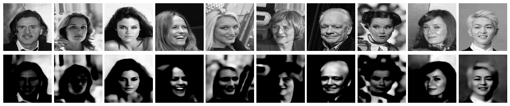
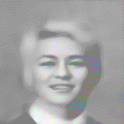

# Face Morphing using a Deep Convolutiol Variational Autoencoder

## Background
The main functionality of the face morpher relies on the underlying variational autoencoder (VAE). The VAE is trained on the CelebA faces dataset. The default network architecture is based on a resolution of (256, 256) and a latent dimension of 256. The corresponding network architecture is presented below. However, custom network parameters are also supported by `train.py`. The network can also be trained on selfie dataset in addition to the celebA dataset.
### Encoder
````
Model: "encoder"
__________________________________________________________________________________________________
Layer (type)                    Output Shape         Param #     Connected to                     
==================================================================================================
input_1 (InputLayer)            (None, 256, 256, 1)  0                                            
__________________________________________________________________________________________________
conv2d_1 (Conv2D)               (None, 256, 256, 64) 640         input_1[0][0]                    
__________________________________________________________________________________________________
max_pooling2d_1 (MaxPooling2D)  (None, 128, 128, 64) 0           conv2d_1[0][0]                   
__________________________________________________________________________________________________
conv2d_2 (Conv2D)               (None, 128, 128, 128 73856       max_pooling2d_1[0][0]            
__________________________________________________________________________________________________
max_pooling2d_2 (MaxPooling2D)  (None, 64, 64, 128)  0           conv2d_2[0][0]                   
__________________________________________________________________________________________________
conv2d_3 (Conv2D)               (None, 64, 64, 128)  147584      max_pooling2d_2[0][0]            
__________________________________________________________________________________________________
max_pooling2d_3 (MaxPooling2D)  (None, 32, 32, 128)  0           conv2d_3[0][0]                   
__________________________________________________________________________________________________
flatten_1 (Flatten)             (None, 131072)       0           max_pooling2d_3[0][0]            
__________________________________________________________________________________________________
z_mean (Dense)                  (None, 256)          33554688    flatten_1[0][0]                  
__________________________________________________________________________________________________
z_log_var (Dense)               (None, 256)          33554688    flatten_1[0][0]                  
__________________________________________________________________________________________________
z (Lambda)                      (None, 256)          0           z_mean[0][0]                     
                                                                 z_log_var[0][0]                  
==================================================================================================
Total params: 67,331,456
Trainable params: 67,331,456
Non-trainable params: 0
__________________________________________________________________________________________________
````

### Decoder
```
Model: "decoder"
_________________________________________________________________
Layer (type)                 Output Shape              Param #   
=================================================================
input_2 (InputLayer)         (None, 256)               0         
_________________________________________________________________
dense_1 (Dense)              (None, 131072)            33685504  
_________________________________________________________________
reshape_1 (Reshape)          (None, 32, 32, 128)       0         
_________________________________________________________________
conv2d_4 (Conv2D)            (None, 32, 32, 128)       147584    
_________________________________________________________________
up_sampling2d_1 (UpSampling2 (None, 64, 64, 128)       0         
_________________________________________________________________
conv2d_5 (Conv2D)            (None, 64, 64, 128)       147584    
_________________________________________________________________
up_sampling2d_2 (UpSampling2 (None, 128, 128, 128)     0         
_________________________________________________________________
conv2d_6 (Conv2D)            (None, 128, 128, 64)      73792     
_________________________________________________________________
up_sampling2d_3 (UpSampling2 (None, 256, 256, 64)      0         
_________________________________________________________________
conv2d_7 (Conv2D)            (None, 256, 256, 1)       257       
=================================================================
Total params: 34,054,721
Trainable params: 34,054,721
Non-trainable params: 0
_________________________________________________________________
```

### Face Morpher

The face morpher works by mapping and input image to a latent space representation using the encoder model. 
A random axis is chosen, and the latent space image representation is modified along the chosen axis. The adjusted 
latent space representation is mapped back to an actual representation using the decoder, resulting in a morphed face. 
  
## Usage

### Train VAE
Use `train.py` to train the model. Example usage:

    python train.py --epochs 10 \
      --image-size 256 \
      --latent-dim 256 \
      --batch-size 12 \
      --workers 4 \
      --model-dir models/ \
      --celeb-dir data/celebA \
      --selfie-dir None
      

#### Model Performance


### Morph faces 
The follow code snippet creates an animation of the morphing process. 
```
morpher = Morpher()
example = morpher.prepare_input('examples/celebA_7.jpg')

latent_img = morpher.map(example)
decoded_face = morpher.generate_face(latent_img)

morph_frames = []
n = 25
morph_axis = np.random.randint(latent_img.shape[1])
morph_constant = 7.5

for i in range(n):
    latent_img[:,morph_axis] += i/n * morph_constant
    morphed_face = morpher.generate_face(latent_img)
    scaled = (morphed_face.reshape(256, 256) + 1) * 127.5
    rgb_array = cv2.cvtColor(scaled.astype('uint8'), cv2.COLOR_GRAY2RGB)
    morph_frames.append(Image.fromarray(rgb_array))

fps = 5
morph_frames[0].save('examples/morphing.gif',
                     format='GIF',
                     append_images=morph_frames[1:],
                     save_all=True,
                     duration=1000 / fps,
                     loop=0)
```



## Requirements
- Keras==2.3.1
- Pillow==7.0.0
- tensorflow==2.1.0
- open-cv==3.4.2

